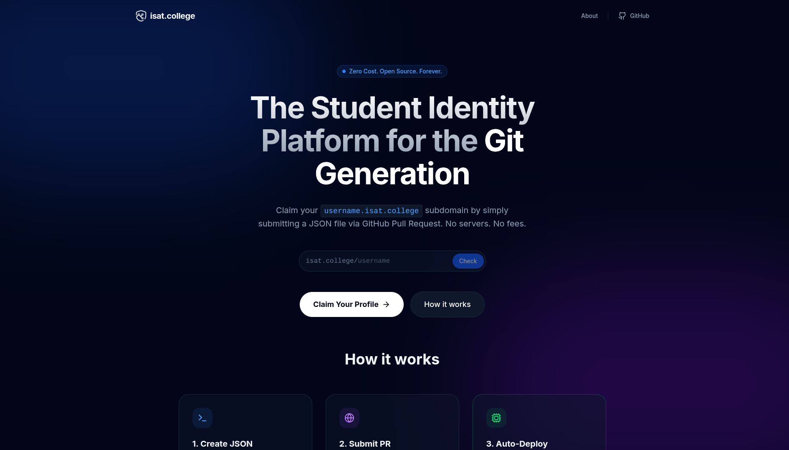

# isat-registry

**The Public Student Identity Registry**

[](https://isat.college)
[](LICENSE)
[](https://github.com/0x98c9/isat-registry/tree/main/students)


> **License:** The content of this registry (schemas, validation scripts, and public profile data) is licensed under the MIT License. This ensures you own your data and can take it anywhere. The isat.college rendering engine is proprietary.

This is the **public registry** for [isat.college](https://isat.college) - a Git-backed student identity platform. Every student profile lives here as a JSON file, giving you complete ownership and portability of your data.



---

## 🎯 What is this?

The **isat-registry** is a community-powered database where students can:
- ✅ Claim their `username.isat.college` subdomain
- ✅ Host their portfolio with **zero cost, forever**
- ✅ Own their data in a public Git repository
- ✅ Update their profile via Pull Requests (GitOps workflow)

**Your data lives here. You own it, not us.**

---

## 📁 Directory Structure

```
isat-registry/
├── students/
│   ├── alice.json
│   ├── bob.json
│   └── <your-username>.json
├── public/
│   └── isat-college-demo.png
└── README.md
```

---

## 🚀 How to Claim Your Profile

### Option 1: Quick Create (Recommended)

[](https://github.com/0x98c9/isat-registry/new/main/students)

Click the button above to create your profile directly on GitHub.

### Option 2: Manual Steps

1. **Fork this repository**
2. **Create a new file** in the `students/` directory
   - Filename: `<your-username>.json` (e.g., `johndoe.json`)
3. **Copy the template** below and fill in your details
4. **Submit a Pull Request**
5. **Wait for validation** - Our bot will check your submission
6. **Get merged** - Your profile goes live at `https://<your-username>.isat.college`

---

## 📋 Profile Template

Copy this template and customize it with your information:

```json
{
  "version": "1.0",
  "type": "portfolio",
  "config": {
    "theme": "modern-dark",
    "accentColor": "#6366f1"
  },
  "profile": {
    "name": "Your Full Name",
    "tagline": "Software Engineer | Open Source Enthusiast",
    "avatar": "https://github.com/yourusername.png",
    "location": "City, Country",
    "email": "you@example.com",
    "resumeUrl": "https://your-resume-link.com"
  },
  "socials": [
    {
      "platform": "github",
      "url": "https://github.com/yourusername"
    },
    {
      "platform": "linkedin",
      "url": "https://linkedin.com/in/yourusername"
    },
    {
      "platform": "twitter",
      "url": "https://twitter.com/yourusername"
    }
  ],
  "education": [
    {
      "institution": "Your University",
      "degree": "B.Tech in Computer Science",
      "year": "2023-2027",
      "grade": "9.2 CGPA"
    }
  ],
  "skills": [
    {
      "category": "Frontend",
      "items": ["React", "TypeScript", "Tailwind CSS", "Next.js"]
    },
    {
      "category": "Backend",
      "items": ["Node.js", "Python", "PostgreSQL"]
    },
    {
      "category": "Tools",
      "items": ["Git", "Docker", "VS Code"]
    }
  ],
  "projects": [
    {
      "name": "Awesome Project",
      "description": "A brief description of what this project does and the problem it solves.",
      "url": "https://github.com/yourusername/project",
      "techStack": ["React", "Node.js", "MongoDB"]
    },
    {
      "name": "Another Cool Project",
      "description": "Another project showcasing your skills.",
      "url": "https://project-demo.com",
      "techStack": ["Python", "FastAPI", "Docker"]
    }
  ]
}
```

---

## ⚙️ Configuration Options

### Theme
- `modern-dark` - Dark theme with modern aesthetics (default)
- `light-minimal` - Clean light theme

### Accent Color
- Any valid hex color code (e.g., `#6366f1`, `#ec4899`, `#10b981`)
- This color will be used for highlights and interactive elements

### Supported Social Platforms
- GitHub
- LinkedIn
- Twitter
- Instagram
- Personal Website (use `platform: "website"`)

---

## ✅ Username Rules

Your username must follow these rules:

- ✅ **Lowercase only** (e.g., `johndoe`, not `JohnDoe`)
- ✅ **Alphanumeric + hyphens** (e.g., `john-doe-123`)
- ✅ **3-30 characters long**
- ❌ **No reserved words** (e.g., `admin`, `root`, `api`, `www`)
- ❌ **No brand names** (e.g., `google`, `microsoft`, `apple`)
- ❌ **No university names** (e.g., `harvard`, `mit`, `stanford`)

**Reserved words are automatically rejected by our validation bot.**

---

## 🤖 Automated Validation

When you submit a Pull Request, our bot will automatically check:

1. ✅ **Username validity** - Not on the banned list
2. ✅ **JSON syntax** - Valid JSON format
3. ✅ **Schema compliance** - Matches the required structure
4. ✅ **Required fields** - All mandatory fields are present

If validation fails, your PR will be marked with ❌ and you'll receive feedback on what to fix.

---

## 🔄 How to Update Your Profile

Already have a profile? Updating is easy:

1. **Edit your JSON file** in the `students/` directory
2. **Commit your changes**
3. **Submit a Pull Request**
4. **Wait for merge** - Changes go live immediately after merge

**Pro tip:** Your profile updates are just Git commits. That's the power of GitOps!

---

## 🌐 How It Works

```
You submit JSON → PR gets validated → Merged to main → 
CDN updates → Your site is live at username.isat.college
```

- **No servers to manage** - We handle the infrastructure
- **No databases** - Your data is in Git
- **No lock-in** - Take your JSON file anywhere
- **No cost** - Free forever

---

## 📜 License

This registry is **MIT Licensed**. Your profile data belongs to you.

---

## 🤝 Community

- **Questions?** Open an [issue](https://github.com/0x98c9/isat-registry/issues)
- **Found a bug?** Submit a [PR](https://github.com/0x98c9/isat-registry/pulls)
- **Want to help?** Check out [contributing guidelines](https://github.com/0x98c9/isat.college/blob/main/CONTRIBUTING.md)

---

## 🎓 About isat.college

isat.college is a **Git-backed student identity platform** that gives students:
- 🆓 Free portfolio subdomain for life
- 🔒 Complete data ownership
- 🚀 Zero lock-in architecture
- 💪 Community-powered infrastructure

**Built by students, for students.**

---

<div align="center">

**Ready to claim your digital identity?**

[](https://github.com/0x98c9/isat-registry/new/main/students)

</div>
